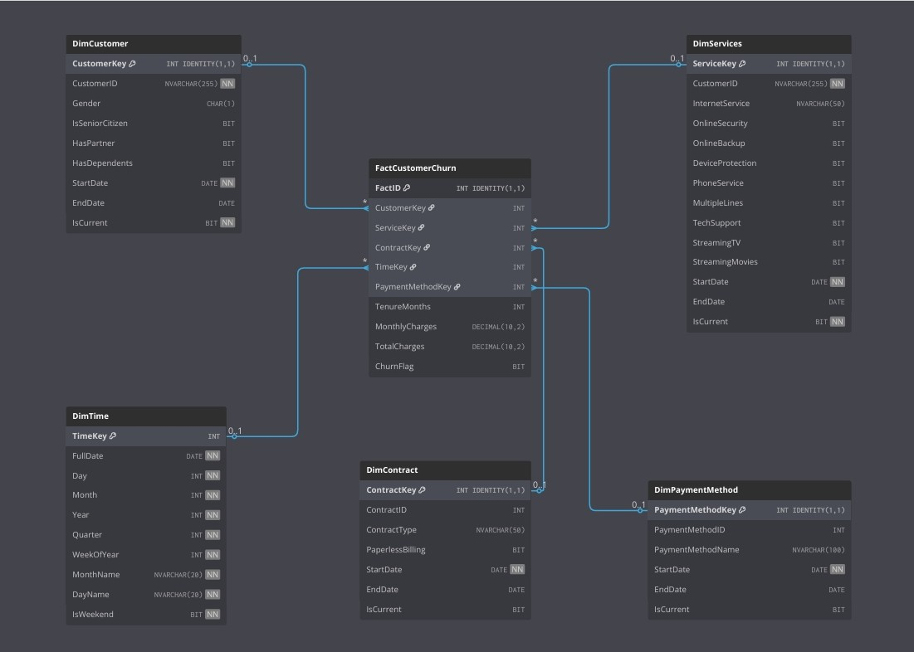
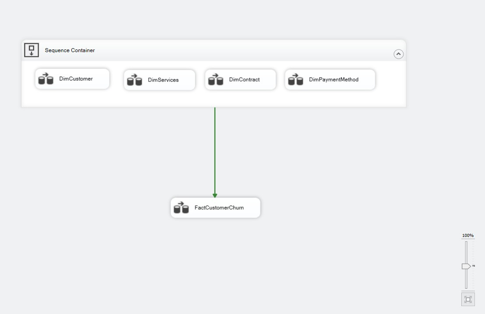
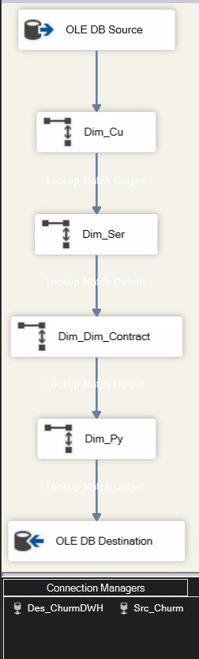
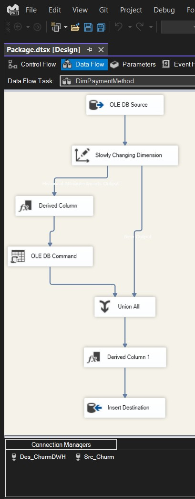

# 📊 Customer Churn - Data Warehouse


## 📌 Folder Structure

```text
DWH/
│
├── DWH_Scripts/
│   ├── 1- DimCustomer.sql
│   ├── 2- DimContract.sql
│   ├── 3- DimPaymentMethod.sql
│   ├── 4- DimServices.sql
│   ├── 5- DimTime.sql
│   └── 6- FactCustomerChurn.sql
│
├── ETL/
│   ├── ETL_Control_Flow.jpg
│   ├── ETL_Data_Flow.jpg
│   ├── ETL_Data_Flow_Payment_DIm.jpg
│   ├── Package.dtsx
│   └── ChurnDWH.bak
│
└── DataWarehouse_Schema.jpeg
```
⭐ 1. Overview
This module represents the Data Warehouse layer of the Customer Insights system. It is designed to provide clean, structured, and analytics-ready data for ML models and Dashboards.

Key Features:

📊 Star Schema designed for Customer Churn Analysis.

⚙️ ELT Pipelines built using SSIS.

🗄️ DWH SQL Scripts (Dimensions + Fact tables).

🔁 SCD (Slowly Changing Dimension) logic implementation.

🔌 Lookup transformations for handling foreign keys.

⭐ 2. Data Warehouse Schema (Star Model)
```

```
The DWH follows a Star Schema architecture centered around FactCustomerChurn, supported by five dimensions:

DimCustomer

DimServices

DimContract

DimPaymentMethod

DimTime

⭐ 3. ELT Pipelines (SSIS)
All pipelines follow ELT logic:

Extract: Load raw data from the source.

Transform: Apply lookups, derived columns, and SCD logic.

Load: Populate dimensions first, followed by the fact table.

▶️ 3.1 Control Flow
```

```
This control flow orchestrates the loading process:

Loads Dimensions: DimCustomer, DimServices, DimContract, DimPaymentMethod.

Loads Fact Table: FactCustomerChurn.

▶️ 3.2 Data Flow – FactCustomerChurn
```

```
Handles the insertion of transactional data.

Source: OLE DB Source.

Transformations: Lookup transformations for all FK keys & Derived columns.

Destination: OLE DB Destination.

▶️ 3.3 Data Flow – Payment Method SCD
```

```
Handles historical changes in payment methods.

Logic: Slowly Changing Dimension (SCD Type 2).

⭐ 4. SQL Scripts
Scripts are located under /DWH_Scripts and handle database object creation:
---
| Order | Script Name | Description |
|------|------|------|
| 1 | DimCustomer.sql | Customer demographics & attributes |
| 2 | DimContract.sql | Contract terms and types |
| 3 | DimPaymentMethod.sql | Payment details (supports SCD) |
| 4 | DimServices.sql | Services subscribed by users |
| 5 | DimTime.sql | Date dimension for time-series analysis |
| 6 | FactCustomerChurn.sql | The central fact table |
---

⭐ 5. How to Run the DWH
✔️ Requirements
Database: SQL Server

ETL Tool: SSIS (Visual Studio / SQL Server Data Tools)

Data: Customer dataset loaded into the staging area.

▶️ Execution Steps
(Optional) Restore ChurnDWH.bak if you want a pre-loaded environment.

Run SQL Scripts: Execute all .sql scripts in order (1 to 6) to create the schema.

Open SSIS Project: Open Package.dtsx in Visual Studio.

Configure Connections: Update the connection managers:

Src_Churn (Source Database)

Des_ChurnDWH (Destination Data Warehouse)

Run Pipeline: Execute the Sequence Container.

Verify: Check SQL Server to ensure dimensions and fact tables are populated.

⭐ 6. Tools & Technologies
Database: SQL Server

ETL: SSIS (SQL Server Integration Services)

Modeling: Star Schema

Techniques: SCD Type 2, Lookup Transformations

IDE: Visual Studio (SSDT)

⭐ 7. Responsibilities & Credits
This DWH & ETL module was implemented by:

Mostafa Sobhy Mahmoud

Role: Data Warehouse & ETL Engineer

Implementation Scope:

✅ DWH Schema Design

✅ ELT Pipeline Development

✅ SCD Logic Implementation

✅ SQL Scripting & Optimization

✅ ETL Orchestration via SSIS

⭐ 8. Notes
Ensure all ETL diagrams exist inside the /ETL folder.

This module is self-contained and reusable for similar churn analysis projects.

🎉 End of Documentation
